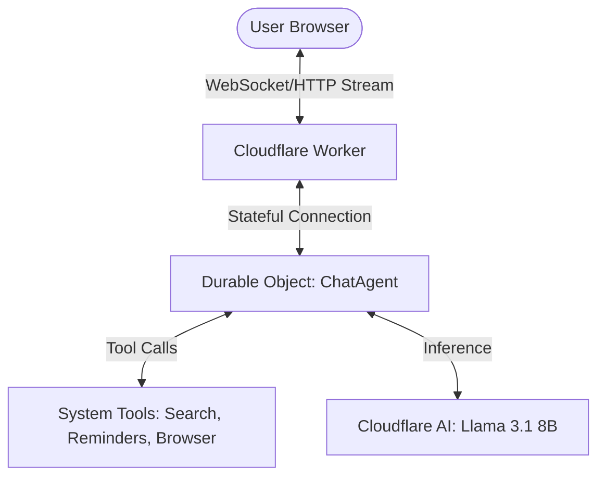

# System Architecture: Sage AI Workspace Assistant

This document provides a technical overview of the Sage AI architecture, focusing on its implementation using Cloudflare Workers, Durable Objects, and AI Chat.

## High-Level Overview

Sage AI is a production-grade workspace assistant that leverages the Cloudflare ecosystem for scalability and low-latency response times.

## Core Components

### 1. Cloudflare Workers & Durable Objects
- **Worker**: Acts as the entry point, routing requests and serving static assets.
- **Durable Object (DO)**: Manages the state of the conversation. Each conversation has its own DO instance, ensuring that context is preserved across multiple turns.

### 2. Message Lifecycle
The agent follows a strict turn-based protocol to ensure logic consistency:
1. **Request**: The user sends a message.
2. **Context Assembly**: The DO retrieves the last N messages and formats them for the LLM.
3. **Inference & Tool Discovery**: The LLM analyzes the query and decides if tool execution is required.
4. **Tool Execution**:
    - **Server-side**: Search (DuckDuckGo) and Reminders (DO Alarms) are executed immediately.
    - **Client-side**: Browser information retrieval is triggered via the UI stream.
5. **Final Response**: The LLM synthesizes the tool outputs and conversation history into a professional response.

### 3. State Management
- **Messages**: Stored within the Durable Object's state.
- **Alarms**: Used for scheduling reminders, ensuring they trigger even if the user is offline.
- **Transactional State**: Durable Object state updates are atomic, preventing race conditions or data corruption.

## Design Decisions

- **Turn-Based Protocol**: We avoid "streaming" tool outputs mid-sentence to maintain 100% protocol integrity with the LLM backend.
- **Guardrails**: Implement specific trigger-word and frequency checks to prevent expensive or redundant tool calls.
- **Premium Persona**: The system prompt is engineered for high-end workspace interactions, prioritizing clarity and professional tone.
